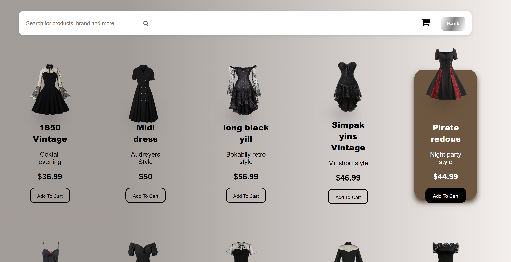

<h1 align="center">👑 Victorian Era Website</h1>

  
  
  

  A multi-page educational website inspired by the Victorian Era, 
  designed with a historical aesthetic and clean modern layout.

---

## 🌍 Live Demo
🔗 https://itsmohana.github.io/victorian-era-website/

---

## 📸 Preview

### 🏛 Home Page

### 🛍 Shop Page

---

## 📂 Project Structure
victorian-era-website/
│
├── css/
│ ├── style.css
│ └── ...
│
├── image/
│ ├── hero.jpg
│ ├── products/
│ └── ...
│
├── index.html
├── family.html
├── era.html
├── painting.html
├── literature.html
├── contact.html
├── shop.html
└── README.md

---

## ✨ Features

- Multi-page layout
- Victorian-inspired typography and color theme
- Clean UI design
- Responsive layout (basic)
- Shop UI page
- Organized folder structure

---

## 🛠 Tech Stack

- HTML5
- CSS3

---

## 🚀 How to Run Locally

1. Clone the repository:
   git clone https://github.com/Itsmohana/victorian-era-website.git
2. Open `index.html` in your browser

---

## 👩‍💻 Author

Made with ❤️ by **mohana**
